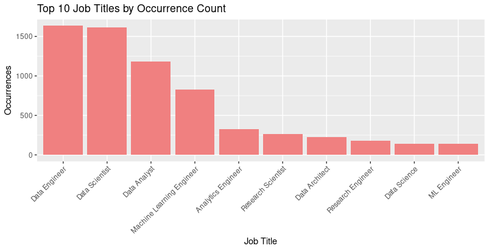
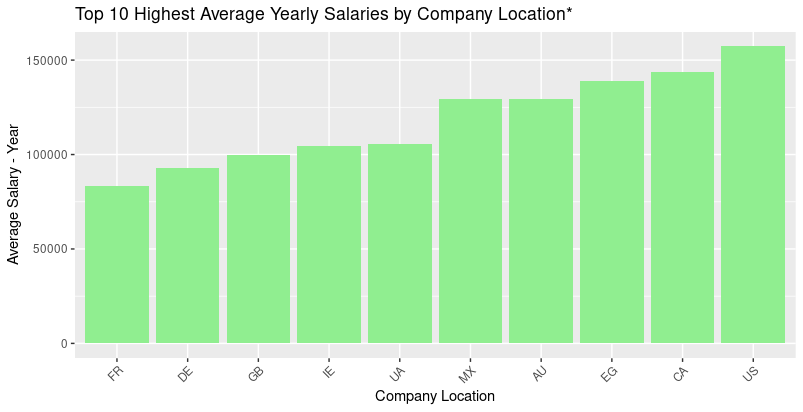

# Salários em Ciência de Dados 2024 - Estudo de Caso

### English (click below):
## [Data Science Job Salaries 2024 - Case Study](#english-version)


## Cenário

Este estudo de caso foi desenvolvido como parte dos requisitos para a conclusão do Curso Google Data Analytics. O tema escolhido, "*Data Science Job Salaries 2024*" (Salários em Ciência de Dados 2024), é altamente relevante, uma vez que oferece uma visão atraente para os graduandos na área de análise de dados, bem como para profissionais estabelecidos. A questão dos salários sempre desperta grande interesse em diversos segmentos da sociedade.

Os dados utilizados neste estudo foram coletados da plataforma Kaggle, uma fonte confiável e reconhecida por sua vasta coleção de conjuntos de dados. Vale ressaltar que os dados são de domínio público, garantindo a transparência e a ética na utilização das informações. Além disso, esses dados são recentes, abrangendo o período de 2020 a 2024, o que os torna altamente relevantes para a análise do mercado atual.

Os insights derivados deste estudo têm o potencial de beneficiar todos aqueles que estão atualmente envolvidos na área de ciência de dados ou que desejam ingressar nesse campo. As descobertas podem servir como um guia, ajudando os profissionais a entender as tendências salariais, as demandas do mercado e os fatores que influenciam os ganhos na área. Essas informações são essenciais para orientar os interessados em tomar decisões informadas sobre suas carreiras e estratégias de desenvolvimento profissional.
## Guia Rápido
### 1. [Pergunta](#1-pergunta)
   - 1.1 [Perguntas ao estudo de caso](#1.1-perguntas-ao-estudo-de-caso)
### 2. [Preparação](#2-preparação)
   - 2.1 [Características dos dados](#21-características-dos-dados2.1)
### 3. [Processar os dados para limpar em R](#3-processar-os-dados-para-limpar-em-r)
   - 3.1 [Pacotes R e banco de dados](#31-pacotes-r-e-banco-de-dados)
   - 3.2 [Sobre os dados](#32-sobre-os-dados)
   - 3.3 [Limpeza](#33-limpeza)
### 4. [Análise (Códigos em R)](#4-análise-códigos-em-r)
   - 4.1 [Ocorrência dos dados](#41-ocorrência-dos-dados)
   - 4.2 [Respondendo às perguntas](#42-respondendo-às-perguntas)
### 5. [Compartilhamento](#5-compartilhamento)
   - 5.1 [Compartilhando ocorrência dos dados](#51-compartilhando-ocorrência-dos-dados)
   - 5.2 [Compartilhando respostas às perguntas](#52-respondendo-às-perguntas)
### 6. [Ação](#6-ação)
   - 6.1 [Considerações](#61-considerações)
   - 6.2 [Sugestão de dados adicionais](#62-sugestão-de-dados-adicionais)

## 1 Pergunta

Tarefa de negócios: Analisar os dados de salários de profissionais de Data Science para obter insights sobre as tendências salariais e os fatores que influenciam os ganhos dos profissionais de Data Science em 2024.

Em seguida, gerar insights visando fornecer uma compreensão abrangente do panorama salarial na área de Data Science e identificar possíveis oportunidades ou desafios para os profissionais nesse campo.

Partes interessadas primárias: Graduandos e profissionais estabelecidos na área de análise de dados, interessados em entender as tendências salariais e as dinâmicas do mercado de trabalho em Data Science.

Partes interessadas secundárias: Interessados em questões salariais e profissionais de diversos segmentos da sociedade que buscam informações sobre ganhos na área de Data Science.

### 1.1 Perguntas ao estudo de caso

- Como variam os salários médios dos profissionais de Data Science de acordo com seu nível de experiência?
- Quais são os cargos de Data Science que apresentam os maiores salários?
- Quais são os cargos de Data Science que experimentaram o maior crescimento percentual de pagamento?
- Qual é a diferença salarial entre profissionais de Data Science que trabalham presencialmente e os que trabalham remotamente?
- Quais são os países que oferecem as maiores médias salariais para profissionais de Data Science em 2024?
- Como os salários dos profissionais de Data Science variam de acordo com a localização da empresa?
- Qual é o impacto do tamanho da empresa na remuneração dos profissionais de Data Science?
- Como o tamanho da empresa influencia a escolha da modalidade de emprego (presencial, remoto, etc.) para os profissionais de Data Science?

--- 

## 2 Preparação

Fonte: Os dados foram obtidos do conjunto " *Data Science Job Salaries 2024*", disponível no Kaggle em 03/04/2024. Este conjunto contém informações sobre salários de empregos no domínio da ciência de dados.

Sobre a fonte de dados, devem seguir os seguintes conceitos:

- Confiável (*Reliable*): Os dados são provenientes de uma fonte confiável, o Kaggle, uma plataforma reconhecida por sua coleção de conjuntos de dados de alta qualidade.

- Original (*Original*): Os dados são originais, coletados e disponibilizados pelo autor do conjunto.

- Abrangente (*Comprehensive*): O conjunto inclui uma ampla variedade de informações sobre salários de empregos em ciência de dados.

- Atual (*Current*): Os dados são recentes, abrangendo o ano de 2024.

- Citado (*Cited*): Os dados foram coletados a partir de terceiros, portanto desconhecidos. Licença de domínio público.

### 2.1 Características dos dados

- Dados secundários, quantitativos, externos e estruturados.

Os dados estão estruturados no formato CSV (*Comma-separated values*), com um tamanho de arquivo de 768 KB, 13.973 linhas e 11 colunas, são elas:

- Ano de trabalho
- Nível de experiência
- Tipo de emprego
- Título do cargo
- Salário
- Moeda do salário
- Salário em USD
- País de residência do funcionário
- Proporção de trabalho remoto
- Localização da empresa
- Tamanho da empresa

## 3 Processar os dados para limpar em R

Nesta etapa, é realizada a limpeza e preparação dos dados para a análise subsequente. Isso incluirá lidar com diversos aspectos, como valores ausentes, duplicados e possíveis inconsistências nos dados.

O objetivo principal é garantir que os dados estejam em um estado adequado e confiável para serem utilizados na análise. Ao realizarmos esse processo, estaremos assegurando que os insights que derivaremos posteriormente sejam baseados em informações precisas e consistentes.

## 3.1 Pacotes R e banco de dados

### 3.1.1 Instalando os pacotes e abrindo as bibliotecas

```r
install.packages("tidyverse")
install.packages("here")
install.packages("skimr")
install.packages("janitor")
install.packages("lubridate")
install.packages("plotly")
library(tidyverse)
library(here)
library(skimr)
library(janitor)
library(lubridate)
library(plotly)
```

### 3.1.2 Importando os conjuntos de dados

```r
salaries <- read_csv("...salaries.csv")
```

## 3.2 Sobre os dados
### Colunas


- **work_year**: O ano em que o salário foi pago.
- **experience_level**: O nível de experiência no emprego durante o ano, com os seguintes valores possíveis: EN (Entry-level) = Júnior / MI (Mid-level) = Intermediário / SE (Senior-level) = Sênior / EX (Executive-level) = Diretor.
- **employment_type**: O tipo de emprego para o cargo: PT = Meio período / FT = Tempo integral / CT = Contrato / FL = Freelance.
- **job_title**: O cargo trabalhado durante o ano.
- **salary**: O montante total do salário bruto pago.
- **salary_currency**: A moeda do salário pago como um código de moeda ISO 4217.
- **salary_in_usd**: O salário em USD (taxa de câmbio dividida pela taxa média de USD para o ano respectivo via [fxdata.foorilla.com]((http://fxdata.foorilla.com/))).
- **employee_residence**: País de residência principal do funcionário durante o ano de trabalho, como código de país ISO 3166.
- **remote_ratio**: A quantidade total de trabalho feito remotamente, com os seguintes valores possíveis: “0” = Sem trabalho remoto (menos de 20%) / “50” = Parcialmente remoto / 100 = Totalmente remoto (mais de 80%).
- **company_location**: O país da sede do empregador ou filial contratada como código de país ISO 3166.
- **company_size**: O número médio de pessoas que trabalharam para a empresa durante o ano: S = menos de 50 funcionários (pequeno) / M = 50 a 250 funcionários (médio) / L = mais de 250 funcionários (grande).

## 3.3 Limpeza

### 3.3.1 Dados distintos
```r
n_distinct(salariesIII$work_year) #5
n_distinct(salariesIII$experience_level) #4
n_distinct(salariesIII$employment_type) #4
n_distinct(salariesIII$job_title) #146
n_distinct(salariesIII$salary) #2237
n_distinct(salariesIII$salary_currency) #23
n_distinct(salariesIII$salary_in_usd) #2596
n_distinct(salariesIII$employee_residence) #88
n_distinct(salariesIII$remote_ratio) #3
n_distinct(salariesIII$company_location) #77
n_distinct(salariesIII$company_size) #3
```
Os resultados da contagem de valores distintos em diferentes colunas fornecem insights valiosos sobre a diversidade e a integridade dos dados. Em particular, observamos que:

- Tanto as colunas "experience_level" quanto "employment_type" apresentam 4 ocorrências, conforme esperado conforme o enunciado do estudo de caso, as colunas "remote_ratio" e "company_size" também mantêm a consistência esperada, com 3 ocorrências cada.
- Uma observação interessante é a variedade considerável nos valores da coluna "job_title", indicando uma ampla gama de cargos ocupados durante o período analisado, da mesma forma, a coluna "salary_in_usd" e "company_location" exibem uma variação significativa em seus valores, o que aumenta a confiabilidade e a representatividade dos dados.

### 3.3.2 Verificando se há valores nulos ou em branco

```r
sum(is.na(salariesIII$work_year)) #0
sum(is.na(salariesIII$experience_level)) #0
sum(is.na(salariesIII$employment_type)) #0
sum(is.na(salariesIII$job_title)) #0
sum(is.na(salariesIII$salary)) #0
sum(is.na(salariesIII$salary_currency)) #0
sum(is.na(salariesIII$salary_in_usd)) #0
sum(is.na(salariesIII$employee_residence)) #0
sum(is.na(salariesIII$remote_ratio)) #0
sum(is.na(salariesIII$company_location)) #0
sum(is.na(salariesIII$company_size)) #0
```
Não foram encontrados valores nulos ou em branco em todas as colunas.

A ausência de espaços em branco permite que procedamos com confiança na exploração e análise dos dados, sem a necessidade de lidar com valores ausentes ou inconsistentes.

### 3.3.3 Garantindo que os dados numéricos que necessitam cálculos estejam como numerais

```r
str(salariesIII)
salariesIII$salary <- as.numeric(salariesIII$salary)
salariesIII$salary_in_usd <- as.numeric(salariesIII$salary_in_usd)
```

É essencial garantir que os dados numéricos estejam formatados adequadamente para que possamos realizar cálculos precisos, como soma, média, mínimo e máximo.

### 3.3.4 Verificando e removendo linhas duplicadas

```r
duplicadas <- sum(duplicated(salariesIII)) # 5378

salariesIII <- salariesIII[!duplicated(salariesIII), ]
```

Após a análise, identificamos 5.378 linhas duplicadas no conjunto de dados. 

Como resultado, todas as linhas que continham exatamente as mesmas informações foram retiradas, mantendo apenas a primeira ocorrência, garantindo que o conjunto de dados final consista apenas em entradas únicas. 

Desta forma, o banco de dados passou de 13.972 linhas para 8.594 linhas. Esta etapa é crucial para garantir a integridade e a precisão das dados.

### 3.3.5 Verificação de valores mínimos, máximos e médios dos salários em USD

```r
min_salary_in_usd <- min(salariesIII$salary_in_usd) # 15000
max_salary_in_usd <- max(salariesIII$salary_in_usd) # 800000
mean_salary_in_usd <- mean(salariesIII$salary_in_usd) # 146745
```

Após a verificação, foi constatado que não há nenhum valor discrepante entre o mínimo e o máximo dos salários em USD.

### 3.3.6 Criando a coluna de salários em USD por mês

```r
salariesIII$salary_monthly <- salariesIII$salary_in_usd/12
```

Em certas regiões, os salários mensais são mais comuns. A conversão dos salários anuais para salários mensais permite uma compreensão mais imediata e facilita a análise e comparação dos dados em diferentes contextos.

### 3.3.7 Removendo as colunas salary e salary_currency

```r
salariesIV <- subset(salariesIII, select = -c(salary, salary_currency))
colnames(salariesIV)
```

A remoção das colunas de salary e salary_currency é realizada para eliminar informações desnecessárias, uma vez que as análises serão realizadas utilizando apenas a moeda dólar americano. Ao manter apenas as colunas relevantes, simplificamos o conjunto de dados e focamos nas variáveis que são importantes para as análises planejadas.

### 3.3.8 Contextualizando o nome da coluna

```r
colnames(salariesIV)[colnames(salariesIV) == "salary_in_usd"] <- "salary_yearly"
colnames(salariesIV)
```

A inclusão da coluna "salary_monthly" e a exclusão das colunas "salary" e "salary_currency" justificam a mudança de nome  da coluna "salary_in_usd" para "salary_yearly”, uma vez que só utilizaremos o USD em análises futuras.

### 3.3.9 Reorganizando as colunas na maneira desejada

```r
salariesIV <- subset(salariesIV, select = c(
  work_year,
  experience_level,
  employment_type,
  job_title,
  salary_yearly,
  salary_monthly,
  employee_residence,
  remote_ratio,
  company_location,
  company_size
))

head(salariesIV)
```

Para melhorar a visualização e a compreensão dos dados, foram reorganizadas as colunas para posicionar a coluna "salary_monthly" ao lado da coluna "salary_yearly". Essa mudança permite uma comparação direta entre os salários anuais e mensais, facilitando a análise dos ganhos ao longo de cada período.

# 4. Análise (Códigos em R)

> O numeral atribuído a cada análise corresponderá à sua referência na apresentação subsequente. Por exemplo, a Análise 4.1 será visual e textualmente apresentada no Compartilhamento 5.1.

##  4.1 Ocorrência dos dados

### 4.1.1 Ano de trabalho
```r
contagem_anos <- table(salariesIV$work_year)

df_contagem_anos <- as.data.frame(contagem_anos)
names(df_contagem_anos) <- c("Ano", "Ocorrências")

df_contagem_anos <- df_contagem_anos[order(df_contagem_anos$Ano), ]

ggplot(df_contagem_anos, aes(x = Ano, y = Ocorrências)) +
  geom_bar(stat = "identity", fill = "lightgreen") +
  labs(title = "Contagem de Ocorrências por Ano", x = "Ano", y = "Ocorrências") +
  theme_minimal()
```
### 4.1.2 Nível de experiência
```r
contagem_xp <- table(salariesIV$experience_level)

df_contagem_xp <- as.data.frame(contagem_xp)
names(df_contagem_xp) <- c("Nível de Experiência", "Ocorrências")

df_contagem_xp$"Nível de Experiência" <- factor(df_contagem_xp$"Nível de Experiência", levels = c("EN", "MI", "SE", "EX"),
                                                labels = c("Júnior", "Intermediário", "Senior", "Diretor"))

df_contagem_xp <- df_contagem_xp[order(match(df_contagem_xp$"Nível de Experiência", c("Júnior", "Intermediário", "Senior", "Diretor"))), ]

ggplot(df_contagem_xp, aes(x = reorder(`Nível de Experiência`, Ocorrências), y = Ocorrências)) +
  geom_bar(stat = "identity", fill = "lightblue") +
  labs(title = "Contagem de Ocorrências por Nível de Experiência", x = "Nível de Experiência", y = "Ocorrências") +
  theme(axis.text.x = element_text(angle = 45, hjust = 1))
```

### 4.1.3 Tipo de emprego
```r
contagem_emprego <- table(salariesIV$employment_type)

df_contagem_emprego <- as.data.frame(contagem_emprego)
names(df_contagem_emprego) <- c("Tipo de Emprego", "Ocorrências")

df_contagem_emprego$"Tipo de Emprego" <- factor(df_contagem_emprego$"Tipo de Emprego", levels = c("PT", "FT", "CT", "FL"),
                                                labels = c("Part-time", "Full-time", "Contract", "Freelance"))

df_contagem_emprego <- df_contagem_emprego[order(match(df_contagem_emprego$"Tipo de Emprego", c("Part-time", "Full-time", "Contract", "Freelance"))), ]

ggplot(df_contagem_emprego, aes(x = reorder(`Tipo de Emprego`, Ocorrências), y = Ocorrências)) +
  geom_bar(stat = "identity", fill = "lightsalmon") +
  labs(title = "Contagem de Ocorrências por Tipo de Emprego", x = "Tipo de Emprego", y = "Ocorrências") +
  theme(axis.text.x = element_text(angle = 45, hjust = 1))
  
  table(salariesIV$employment_type=="FT") # 8534 de 8594
  ```
### 4.1.4 Título do cargo
```r
contagem_cargo <- table(salariesIV$job_title)

df_contagem_cargo <- as.data.frame(contagem_cargo)
names(df_contagem_cargo) <- c("Título do Cargo", "Ocorrências")

df_contagem_cargo <- df_contagem_cargo[order(-df_contagem_cargo$Ocorrências), ]

df_contagem_cargo <- head(df_contagem_cargo, 10)

ggplot(df_contagem_cargo, aes(x = reorder(`Título do Cargo`, -Ocorrências), y = Ocorrências)) +
  geom_bar(stat = "identity", fill = "lightcoral") +
  labs(title = "Top 10 Títulos de Cargo por Contagem de Ocorrências", x = "Título de Cargo", y = "Ocorrências") +
  theme(axis.text.x = element_text(angle = 45, hjust = 1))
```

### 4.1.5 País de residência do funcionário
```r
contagem_residencia <- table(salariesIV$employee_residence)

df_contagem_residencia <- as.data.frame(contagem_residencia)
names(df_contagem_residencia) <- c("País de Residência", "Ocorrências")

df_contagem_residencia <- df_contagem_residencia[order(-df_contagem_residencia$Ocorrências), ]

df_contagem_residencia <- head(df_contagem_residencia, 5)

ggplot(df_contagem_residencia, aes(x = reorder(`País de Residência`, -Ocorrências), y = Ocorrências)) +
  geom_bar(stat = "identity", fill = "yellow") +
  labs(title = "Top 5 Países de Residência dos Funcionários", x = "País de Residência", y = "Ocorrências") +
  theme(axis.text.x = element_text(angle = 45, hjust = 1))
  
table(salariesIV$employee_residence =="US") # 7026 de 8594
table(salariesIV$employee_residence =="GB") # 474 de 8594
```

### 4.1.6 Proporção de trabalho remoto
```r
contagem_remoto <- table(salariesIV$remote_ratio)

df_contagem_remoto <- as.data.frame(contagem_remoto)
names(df_contagem_remoto) <- c("Proporção de Trabalho Remoto", "Ocorrências")

df_contagem_remoto$`Proporção de Trabalho Remoto` <- factor(df_contagem_remoto$`Proporção de Trabalho Remoto`, levels = c("0", "50", "100"))

ggplot(df_contagem_remoto, aes(x = `Proporção de Trabalho Remoto`, y = Ocorrências, fill = `Proporção de Trabalho Remoto`)) +
  geom_bar(stat = "identity") +
  labs(title = "Proporção de Trabalho Remoto", x = "Proporção de Trabalho Remoto", y = "Ocorrências", fill = "Proporção de Trabalho Remoto") +
  scale_fill_manual(values = c("lightblue", "lightgreen", "lightcoral"),
                    labels = c("Sem trabalho remoto", "Parcialmente remoto", "Totalmente remoto")) +
  theme(axis.text.x = element_text(angle = 45, hjust = 1))
  ```

### 4.1.7 Localização da empresa
```r
contagem_localizacao <- table(salariesIV$company_location)

df_contagem_localizacao <- as.data.frame(contagem_localizacao)
names(df_contagem_localizacao) <- c("País de Localização da Empresa", "Ocorrências")

df_contagem_localizacao <- df_contagem_localizacao[order(-df_contagem_localizacao$Ocorrências), ]

df_contagem_localizacao <- head(df_contagem_localizacao, 5)

ggplot(df_contagem_localizacao, aes(x = reorder(`País de Localização da Empresa`, -Ocorrências), y = Ocorrências)) +
  geom_bar(stat = "identity", fill = "green") +
  labs(title = "Top 5 Países de Localização da Empresa", x = "País de Localização da Empresa", y = "Ocorrências") +
  theme(axis.text.x = element_text(angle = 45, hjust = 1))


table(salariesIV$company_location == "US") # 7075 de 8594
table(salariesIV$company_location == "GB") # 481 de 8594
```

### 4.1.8 Tamanho da empresa
```r
contagem_tamanho_empresa <- table(salariesIV$company_size)

df_contagem_tamanho_empresa <- as.data.frame(contagem_tamanho_empresa)
names(df_contagem_tamanho_empresa) <- c("Tamanho da Empresa", "Ocorrências")

df_contagem_tamanho_empresa$`Tamanho da Empresa` <- factor(df_contagem_tamanho_empresa$`Tamanho da Empresa`, levels = c("S", "M", "L"))

ggplot(df_contagem_tamanho_empresa, aes(x = `Tamanho da Empresa`, y = Ocorrências, fill = `Tamanho da Empresa`)) +
  geom_bar(stat = "identity") +
  labs(title = "Distribuição do Tamanho da Empresa", x = "Tamanho da Empresa", y = "Ocorrências", fill = "Tamanho da Empresa") +
  scale_fill_manual(values = c("lightblue", "lightgreen", "lightcoral"),
                    labels = c("Pequena", "Média", "Grande")) +
  theme(axis.text.x = element_text(angle = 45, hjust = 1))
  ```

## 4.2 Respondendo às perguntas

### 4.2.1 Percentual de funcionários trabalhando para empresas estrangeiras

```r
ocorrencias_diferentes_paises <- sum(salariesIV$employee_residence != salariesIV$company_location) # 127 de 8594
```

### 4.2.2 Média dos salários por nível de experiência

```r
media_salario_por_experiencia <- salariesIV %>%
  group_by(experience_level) %>%
  summarize(media_salario = mean(salary_yearly))

media_salario_por_experiencia$experience_level <- factor(media_salario_por_experiencia$experience_level, levels = c("EN", "MI", "SE", "EX"))

media_salario_por_experiencia$experience_level <- factor(media_salario_por_experiencia$experience_level, labels = c("Júnior", "Intermediário", "Senior", "Diretor"))

ggplot(media_salario_por_experiencia, aes(x = experience_level, y = media_salario, fill = experience_level)) +
  geom_bar(stat = "identity") +
  labs(title = "Média de Salário por Nível de Experiência",
       x = "Nível de Experiência",
       y = "Média de Salário",
       fill = "Nível de Experiência") +
  theme(axis.text.x = element_text(angle = 45, hjust = 1))
  
  
  media_salario_por_experiencia <- salariesIV %>%
  group_by(experience_level) %>%
  summarize(media_salario = mean(salary_monthly))

media_salario_por_experiencia$experience_level <- factor(media_salario_por_experiencia$experience_level, levels = c("EN", "MI", "SE", "EX"))

media_salario_por_experiencia$experience_level <- factor(media_salario_por_experiencia$experience_level, labels = c("Júnior", "Intermediário", "Senior", "Diretor"))

ggplot(media_salario_por_experiencia, aes(x = experience_level, y = media_salario, fill = experience_level)) +
  geom_bar(stat = "identity") +
  labs(title = "Média de Salário por Nível de Experiência - Mensal",
       x = "Nível de Experiência",
       y = "Média de Salário",
       fill = "Nível de Experiência") +
  theme(axis.text.x = element_text(angle = 45, hjust = 1))
```

### 4.2.3 Títulos dos cargos mais bem pagos

```r
media_salario_por_cargo <- salariesIV %>%
  group_by(job_title) %>%
  summarize(media_salario = mean(salary_yearly)) %>%
  arrange(desc(media_salario)) %>%
  top_n(10)

ggplot(media_salario_por_cargo, aes(x = reorder(job_title, media_salario), y = media_salario, fill = job_title)) +
  geom_bar(stat = "identity") +
  labs(title = "10 Cargos Mais Bem Pagos - Anualmente",
       x = "Título do Cargo",
       y = "Média de Salário Anual") +
  theme(axis.text.x = element_text(angle = 45, hjust = 1),
        legend.position = "none")  +
  scale_y_continuous(labels = scales::number_format(scale = 1e-3, suffix = "k"))
  
  
  media_salario_por_cargo <- salariesIV %>%
  group_by(job_title) %>%
  summarize(media_salario = mean(salary_monthly)) %>%
  arrange(desc(media_salario)) %>%
  top_n(10)

ggplot(media_salario_por_cargo, aes(x = reorder(job_title, media_salario), y = media_salario, fill = job_title)) +
  geom_bar(stat = "identity") +
  labs(title = "10 Cargos Mais Bem Pagos - Mensalmente",
       x = "Título do Cargo",
       y = "Média de Salário Mensal") +
  theme(axis.text.x = element_text(angle = 45, hjust = 1),
        legend.position = "none")  +
  scale_y_continuous(labels = scales::number_format(scale = 1e-3, suffix = "k"))
```

### 4.2.4 Cargos com maior crescimento percentual (2023-2024)

```r
cargos_com_10_ocorrencias <- salariesIV %>%
  filter(work_year %in% c(2023, 2024)) %>%
  group_by(job_title, work_year) %>%
  summarize(ocorrencias = n()) %>%
  filter(ocorrencias >= 10) %>%
  pull(job_title)

salaries_filtrados <- salariesIV %>%
  filter(job_title %in% cargos_com_10_ocorrencias, work_year %in% c(2023, 2024))

crescimento_por_cargo <- salaries_filtrados %>%
  group_by(job_title) %>%
  summarize(percentual_crescimento = ((mean(salary_yearly[work_year == 2024]) - mean(salary_yearly[work_year == 2023])) / mean(salary_yearly[work_year == 2023])) * 100) %>%
  arrange(desc(percentual_crescimento)) %>%
  head(10)

ggplot(crescimento_por_cargo, aes(x = reorder(job_title, desc(percentual_crescimento)), y = percentual_crescimento)) +
  geom_bar(stat = "identity", fill = "lightblue") +
  labs(title = "10 Cargos com Maior Crescimento % de Pagamento (2023-2024)*",
       x = "Cargo",
       y = "Percentual de Crescimento") +
  theme(axis.text.x = element_text(angle = 45, hjust = 1))
```

### 4.2.5 Diferença salarial entre as modalidades (Presencial e Remoto)

```r
salariesIV$experience_level <- factor(salariesIV$experience_level, levels = c("EN", "MI", "SE", "EX"))

salaries_filtered <- salariesIV %>%
  filter(remote_ratio %in% c(0, 100))

media_salario_por_senioridade_e_modalidade <- salaries_filtered %>%
  group_by(experience_level, remote_ratio) %>%
  summarize(media_salario = mean(salary_yearly))

media_salario_por_senioridade_e_modalidade$modalidade <- ifelse(media_salario_por_senioridade_e_modalidade$remote_ratio == 0, "Presencial", "Remoto")

ggplot(media_salario_por_senioridade_e_modalidade, aes(x = experience_level, y = media_salario, fill = modalidade)) +
  geom_bar(stat = "identity", position = "dodge") +
  labs(title = "Média Salarial por Nível de Experiência e Modalidade - Anual",
       x = "Nível de Experiência",
       y = "Média Salarial - Ano",
       fill = "Modalidade") +
  theme_minimal()
  
  
  salariesIV$experience_level <- factor(salariesIV$experience_level, levels = c("EN", "MI", "SE", "EX"))

salaries_filtered <- salariesIV %>%
  filter(remote_ratio %in% c(0, 100))

media_salario_por_senioridade_e_modalidade <- salaries_filtered %>%
  group_by(experience_level, remote_ratio) %>%
  summarize(media_salario = mean(salary_monthly))

media_salario_por_senioridade_e_modalidade$modalidade <- ifelse(media_salario_por_senioridade_e_modalidade$remote_ratio == 0, "Presencial", "Remoto")

ggplot(media_salario_por_senioridade_e_modalidade, aes(x = experience_level, y = media_salario, fill = modalidade)) +
  geom_bar(stat = "identity", position = "dodge") +
  labs(title = "Média Salarial por Nível de Experiência e Modalidade - Mensal",
       x = "Nível de Experiência",
       y = "Média Salarial - Mês",
       fill = "Modalidade") +
  theme_minimal()
  
  table(salariesIV$remote_ratio == "50") # 239 de 8594
```

### 4.2.6 Países com as maiores médias salariais

```r
media_salarial_por_pais <- salariesIV %>%
  group_by(employee_residence) %>%
  summarize(media_salarial = mean(salary_yearly),
            ocorrencias = n()) %>%
  filter(ocorrencias >= 10) %>% 
  top_n(10, media_salarial) %>%
  arrange(media_salarial) 

ggplot(media_salarial_por_pais, aes(x = reorder(employee_residence, media_salarial), y = media_salarial)) +
  geom_bar(stat = "identity", fill = "skyblue") +
  labs(title = "10 Médias Salariais Mais Altas por País - Anual*",
       x = "País de Residência",
       y = "Média Salarial - Ano",
       fill = NULL) +
  theme(axis.text.x = element_text(angle = 45, hjust = 1))
  
  
  media_salarial_por_pais <- salariesIV %>%
  group_by(employee_residence) %>%
  summarize(media_salarial = mean(salary_monthly),
            ocorrencias = n()) %>%
  filter(ocorrencias >= 10) %>% 
  top_n(10, media_salarial) %>%
  arrange(media_salarial) 

ggplot(media_salarial_por_pais, aes(x = reorder(employee_residence, media_salarial), y = media_salarial)) +
  geom_bar(stat = "identity", fill = "skyblue") +
  labs(title = "10 Médias Salariais Mais Altas por País - Mensal*",
       x = "País de Residência",
       y = "Média Salarial - Mês",
       fill = NULL) +
  theme(axis.text.x = element_text(angle = 45, hjust = 1))
```

### 4.2.7 Comparação de salários por localização da empresa

```r
media_salarial_por_localizacao <- salariesIV %>%
  group_by(company_location) %>%
  summarize(media_salarial = mean(salary_yearly),
            ocorrencias = n()) %>%
  filter(ocorrencias >= 10) %>%  
  top_n(10, media_salarial) %>%
  arrange(desc(media_salarial)) 

ggplot(media_salarial_por_localizacao, aes(x = reorder(company_location, media_salarial), y = media_salarial)) +
  geom_bar(stat = "identity", fill = "lightgreen") +
  labs(title = "10 Médias Salariais Mais Altas por Localização da Empresa - Anual*",
       x = "Localização da Empresa",
       y = "Média Salarial - Ano",
       fill = NULL) +
  theme(axis.text.x = element_text(angle = 45, hjust = 1))
```

### 4.2.8 Disparidades salariais entre diferentes tamanhos de empresa

```r
media_salarial_por_tamanho_empresa_e_senioridade <- salariesIV %>%
  group_by(company_size, experience_level) %>%
  summarize(media_salarial = mean(salary_yearly))

ggplot(media_salarial_por_tamanho_empresa_e_senioridade, aes(x = company_size, y = media_salarial, fill = experience_level)) +
  geom_bar(stat = "identity", position = "dodge") +
  labs(title = "Médias Salariais por Tamanho de Empresa - Anual",
       x = "Tamanho da Empresa",
       y = "Média Salarial - Ano",
       fill = "Nível de Experiência") +
  theme(axis.text.x = element_text(angle = 45, hjust = 1))

media_salarial_por_tamanho_empresa_e_senioridade <- salariesIV %>%
  group_by(company_size, experience_level) %>%
  summarize(media_salarial = mean(salary_monthly))

ggplot(media_salarial_por_tamanho_empresa_e_senioridade, aes(x = company_size, y = media_salarial, fill = experience_level)) +
  geom_bar(stat = "identity", position = "dodge") +
  labs(title = "Médias Salariais por Tamanho de Empresa - Mensal",
       x = "Tamanho da Empresa",
       y = "Média Salarial - Mês",
       fill = "Nível de Experiência") +
  theme(axis.text.x = element_text(angle = 45, hjust = 1))
```

### 4.2.9 Análise da relação entre tamanho da empresa e modalidade de emprego

```r
salaries_small <- subset(salariesIV, company_size == "S")

contingency_table <- table(salaries_small$remote_ratio)

contingency_df <- as.data.frame(contingency_table)
names(contingency_df) <- c("Tipo de Trabalho", "Count")

contingency_df$Percentage <- contingency_df$Count / sum(contingency_df$Count) * 100

contingency_df$Remote_Ratio_Label <- ifelse(contingency_df$"Tipo de Trabalho" == 0, "Presencial",
                                            ifelse(contingency_df$"Tipo de Trabalho" == 50, "Semi-Presencial", "Remoto"))

pie_chart <- ggplot(contingency_df, aes(x = "", y = Percentage, fill = factor(Remote_Ratio_Label))) +
  geom_bar(stat = "identity", width = 1) +
  geom_text(aes(label = paste0(round(Percentage, 1), "%")), position = position_stack(vjust = 0.5), size = 3) +
  coord_polar("y", start = 0) +
  labs(title = "Proporção de Tipo Trabalho para Empresas PEQUENAS",
       fill = "Tipo de Trabalho") +
  theme_void() +
  theme(legend.position = "right")

print(pie_chart)

table(salariesIV$company_size == "S") #177

salaries_medium <- subset(salariesIV, company_size == "M")

contingency_table <- table(salaries_medium$remote_ratio)

contingency_df <- as.data.frame(contingency_table)
names(contingency_df) <- c("Tipo de Trabalho", "Count")

contingency_df$Percentage <- contingency_df$Count / sum(contingency_df$Count) * 100

contingency_df$Remote_Ratio_Label <- ifelse(contingency_df$"Tipo de Trabalho" == 0, "Presencial",
                                            ifelse(contingency_df$"Tipo de Trabalho" == 50, "Semi-Presencial", "Remoto"))

pie_chart <- ggplot(contingency_df, aes(x = "", y = Percentage, fill = factor(Remote_Ratio_Label))) +
  geom_bar(stat = "identity", width = 1) +
  geom_text(aes(label = paste0(round(Percentage, 1), "%")), position = position_stack(vjust = 0.5), size = 3) +
  coord_polar("y", start = 0) +
  labs(title = "Proporção de Tipo Trabalho para Empresas MÉDIAS",
       fill = "Tipo de Trabalho") +
  theme_void() +
  theme(legend.position = "right")

print(pie_chart)

table(salariesIV$company_size == "M") #7805

salaries_large <- subset(salariesIV, company_size == "L")

contingency_table <- table(salaries_large$remote_ratio)

contingency_df <- as.data.frame(contingency_table)
names(contingency_df) <- c("Tipo de Trabalho", "Count")

contingency_df$Percentage <- contingency_df$Count / sum(contingency_df$Count) * 100

contingency_df$Remote_Ratio_Label <- ifelse(contingency_df$"Tipo de Trabalho" == 0, "Presencial",
                                            ifelse(contingency_df$"Tipo de Trabalho" == 50, "Semi-Presencial", "Remoto"))

pie_chart <- ggplot(contingency_df, aes(x = "", y = Percentage, fill = factor(Remote_Ratio_Label))) +
  geom_bar(stat = "identity", width = 1) +
  geom_text(aes(label = paste0(round(Percentage, 1), "%")), position = position_stack(vjust = 0.5), size = 3) +
  coord_polar("y", start = 0) +
  labs(title = "Proporção de Tipo Trabalho para Empresas GRANDES",
       fill = "Tipo de Trabalho") +
  theme_void() +
  theme(legend.position = "right")

print(pie_chart)

table(salariesIV$company_size == "L") #612
```

# 5 Compartilhamento
> O numeral atribuído a cada análise corresponderá à sua referência na apresentação subsequente. Por exemplo, a Análise 4.1 será visual e textualmente apresentada no Compartilhamento 5.1.

## 5.1 Compartilhando ocorrência dos dados

### 5.1.1 Ano de trabalho


### 5.1.2 Nível de experiência


### 5.1.3 Tipo de emprego


### 5.1.4 Título do cargo


### 5.1.5 País de residência do funcionário


### 5.1.6 Proporção de trabalho remoto


### 5.1.7 Localização da empresa


### 5.1.8 Tamanho da empresa


- A análise revela que a maioria dos dados está concentrada nos anos de 2022 a 2024. Isso indica uma atualização recente do banco de dados, o que é crucial para garantir análises atualizadas.
- Observou-se uma distribuição variada entre os diferentes níveis de experiência. Essa diferenciação será essencial para análises mais aprofundadas, uma vez que é comum haver disparidades salariais significativas entre esses grupos.
- A predominância esmagadora de empregos em tempo integral (99,3%) é um achado relevante, pois sugere que a maioria dos funcionários no conjunto de dados está totalmente dedicada ao trabalho. Esta uniformidade na opção de emprego facilitará comparações significativas entre pessoas que ocupam integralmente seu tempo no trabalho.
- A análise revela uma predominância do trabalho presencial em relação ao trabalho remoto. Será valioso investigar se essa diferenciação na proporção de trabalho remoto está associada a diferenças salariais entre os funcionários.
- Os Estados Unidos surgem como o país de residência predominante, representando 81,7% das ocorrências. Assim como o país de residência do funcionário, os Estados Unidos também se destacam como a localização principal das empresas, representando 82,3% das ocorrências. No entanto, é crucial explorar se a localização da empresa tem impacto nos salários dos funcionários, especialmente em comparação com a localização do funcionário. A Grã-Bretanha tem 5,5% das ocorrências e aparece na segunda opção em ambos.

## 5.2 Compartilhando respostas às perguntas

### 5.2.1 Percentual de funcionários trabalhando para empresas estrangeiras

Ao examinar os dados, surge a questão de quantos funcionários trabalham para empresas localizadas fora de seus países de residência.

Dos 8.594 registros analisados, apenas 127 indicam que os funcionários estão empregados em empresas estrangeiras, representando meros 1,5% do total. Essa descoberta sugere que, embora a globalização tenha facilitado a mobilidade internacional no mercado de trabalho, a maioria dos funcionários permanece empregada em empresas localizadas em seus países de residência.

Essa observação pode ter implicações significativas para políticas de imigração, tendências de trabalho remoto e oportunidades de carreira internacional.

### 5.2.2 Média dos salários por nível de experiência


**Valores em USD*

Ao analisar a média dos salários por nível de experiência, observamos uma tendência esperada: os salários aumentam à medida que a senioridade aumenta, como demonstrado nos gráficos acima.

Essa informação é valiosa para profissionais que planejam suas trajetórias de carreira e para empregadores que buscam estabelecer políticas salariais equitativas e competitivas.

### 5.2.3 Títulos dos cargos mais bem pagos


**Valores em USD*

Os gráficos acima destacam a diferença significativa entre os salários dos cargos de maior remuneração em relação aos demais.

É interessante notar que, mesmo dentro do campo da Ciência de Dados, existem cargos que se destacam em termos de remuneração. A diferença entre o cargo mais bem pago e o décimo colocado é substancial, especialmente considerando que essa análise abrange apenas os dez melhores de um total de 146 cargos distintos.

Essas informações são valiosas para profissionais que buscam maximizar seus rendimentos e para empregadores que desejam entender melhor as tendências salariais em suas respectivas indústrias.

### 5.2.4 Cargos com maior crescimento percentual (2023-2024)


Os gráficos acima ilustram os cargos que apresentaram o maior crescimento percentual de pagamento entre os anos de 2023 e 2024. É importante destacar que esse crescimento não necessariamente indica os cargos de maior remuneração absoluta, mas sim aqueles que experimentaram o maior aumento percentual no período analisado.

Esta análise pode fornecer insights sobre tendências emergentes no mercado de trabalho e pode direcionar a atenção para áreas específicas que estão experimentando um crescimento significativo em termos de remuneração.

Neste caso, muitos dos cargos identificados estão diretamente ligados à Inteligência Artificial, como MLOps Engineer, AI Scientist, AI Architect e Head of Data.

### 5.2.5 Diferença salarial entre as modalidades (Presencial e Remoto)


**Valores em USD*

Os gráficos acima apresentam uma análise da diferença salarial entre modalidades de trabalho, classificadas como presencial ou remoto, em relação ao nível de experiência dos funcionários.

Observa-se que, em média, os funcionários que trabalham presencialmente recebem salários mais altos do que aqueles que trabalham remotamente. Esta disparidade salarial é consistente em todos os níveis de experiência, ecxceto nos cargos de diretoria, conforme ilustrado nos gráficos.

Essa discrepância pode ser atribuída a uma variedade de fatores, incluindo políticas de remuneração diferenciadas para funcionários remotos, custo de vida em diferentes regiões geográficas e até mesmo preferências pessoais dos funcionários em relação ao trabalho presencial versus remoto.

É importante destacar que, embora os funcionários remotos possam receber salários menores em média, essa modalidade de trabalho oferece outras vantagens, como flexibilidade de horários e eliminação de deslocamentos, que podem ser valorizadas por alguns profissionais.

Esses insights são relevantes para profissionais que estão considerando oportunidades de emprego e para empresas que desejam desenvolver políticas de remuneração competitivas e equitativas para seus funcionários, independentemente da modalidade de trabalho adotada.

> **Nota:** A análise foi realizada considerando apenas as modalidades de trabalho presencial e remoto. A modalidade semi-presencial foi excluída da análise devido ao baixo número de ocorrências, representando apenas 2,78% do total de dados. Sua exclusão não afeta substancialmente as conclusões desta análise.

### 5.2.6 Países com as maiores médias salariais


**Valores em USD*

Ao analisar as médias salariais por país, observamos que os Estados Unidos lideram com a maior remuneração média, seguidos por Canadá e México. Esses resultados refletem a forte presença das empresas de ciência de dados na América do Norte. Além disso, países altamente desenvolvidos da Europa e Austrália também figuram entre os que oferecem maiores salários, o que está em linha com as expectativas.

Surpreendentemente, países como Ucrânia e Egito também se destacam neste cenário.

Esses resultados podem indicar oportunidades emergentes em mercados menos tradicionais, sugerindo que profissionais em busca de melhorias salariais podem considerar expandir suas perspectivas além dos mercados mais convencionais.

> **Nota:** É importante ressaltar que países com menos de 10 ocorrências foram excluídos da análise para evitar distorções nos dados.

### 5.2.7 Comparação de salários por localização da empresa


**Valores em USD*

Ao analisar as médias salariais por localização da empresa, observamos que os Estados Unidos se destacam, com empresas oferecendo as maiores remunerações anuais. Este resultado reflete a forte economia e o alto custo de vida associado aos centros de tecnologia nos Estados Unidos, como o Vale do Silício e outras regiões metropolitanas importantes.

No entanto, também é interessante notar que países como Canadá, Egito e Austrália aparecem entre os líderes em termos de remuneração, indicando ambientes econômicos favoráveis e setores de tecnologia prósperos.

>**Nota:** É importante ressaltar que países com menos de 10 ocorrências foram excluídos da análise para evitar distorções nos dados.

### 5.2.8 Disparidades salariais entre diferentes tamanhos de empresa


**Valores em USD*

Ao analisar as médias salariais por tamanho de empresa e nível de experiência, observamos padrões interessantes que merecem atenção.

Os gráficos apresentados revelam que, em geral, as curvas de crescimento salarial são semelhantes nos três tamanhos de empresa considerados: pequenas, médias e grandes. No entanto, uma descoberta intrigante é que as empresas de médio porte mostram médias salariais mais altas do que as grandes empresas. Isso é contra intuitivo, já que normalmente se espera que empresas maiores ofereçam remunerações mais generosas.

Essa discrepância pode ser atribuída a um fenômeno conhecido como "compactação salarial", no qual empresas menores, apesar de terem menos funcionários, podem ser capazes de oferecer salários mais altos devido à sua eficiência e capacidade de entregar alto rendimento com uma equipe enxuta.

Essa análise destaca a importância de não focar exclusivamente nas gigantes corporativas ao buscar oportunidades de carreira. Em vez disso, os profissionais devem estar abertos a explorar empresas de médio porte, que podem oferecer remunerações competitivas e um ambiente de trabalho mais dinâmico e ágil.

### 5.2.9 Análise da relação entre tamanho da empresa e modalidade de emprego


Os gráficos acima oferecem uma análise da relação entre o tamanho da empresa e a modalidade de emprego, classificada como presencial, semi-presencial ou remota.

Para empresas de pequeno porte (177 ocorrências), a proporção de empregos remotos é notavelmente maior, representando 58,8% do total. Em contraste, as empresas de médio porte (7805 ocorrências) mostram uma predominância de empregos presenciais, 64,5%. Por fim, as empresas de grande porte (612 ocorrências) exibem uma proporção mais equilibrada entre os diferentes tipos de emprego, com 33,3% presencial, 42,8% remoto e 23,9% semi-presencial.

Esses dados fornecem insights valiosos sobre as práticas de trabalho adotadas por empresas de diferentes tamanhos. Embora a percepção geral possa ser de que a tecnologia facilita o trabalho remoto, a realidade revela uma diversidade de abordagens, com empresas menores optando mais pelo trabalho remoto, enquanto as maiores mantêm uma presença significativa no local de trabalho físico.

Entender esses padrões é crucial para profissionais que buscam alinhar suas expectativas de trabalho com as práticas predominantes em empresas de diferentes tamanhos. Além disso, os empregadores podem usar essas informações para adaptar suas políticas de trabalho e atrair talentos de acordo com as preferências de modalidade de emprego.

# 6 Ação

Após uma análise abrangente dos dados sobre salários na área de Ciência de Dados, várias conclusões e insights surgiram, oferecendo orientações valiosas para ações futuras.

### 6.1 Considerações

- **Diferenças salariais:** A análise revela que a remuneração no campo da Ciência de Dados é influenciada por uma variedade de fatores, incluindo localização da empresa, tamanho da empresa, modalidade de emprego e nível de experiência. Compreender essas nuances é essencial para profissionais que buscam otimizar seus ganhos e sua satisfação no trabalho.
- **Antecipação de tendências do mercado:** A identificação de tendências emergentes, como cargos com crescimento salarial significativo e mercados menos explorados com altas médias salariais, oferece insights valiosos para profissionais que buscam se manter competitivos e adaptáveis em um ambiente de trabalho dinâmico.
- **Exploração inteligente de mercados alternativos:** Além de considerar os mercados tradicionais, os profissionais de Ciência de Dados podem se beneficiar ao explorar oportunidades em mercados emergentes e menos convencionais, onde a demanda por talentos pode estar crescendo e oferecendo potenciais pacotes salariais competitivos.
- **Autoavaliação e adaptação constante:** Manter-se atualizado sobre as tendências do mercado, avaliar regularmente a remuneração em relação ao mercado e estar aberto a explorar novas oportunidades são práticas essenciais para profissionais que buscam prosperar e se destacar em um campo tão dinâmico como a Ciência de Dados.

### 6.2 Sugestão de dados adicionais

- **Dados de satisfação do funcionário:** Incorporar dados de satisfação do funcionário para entender melhor o impacto das disparidades salariais na motivação e retenção dos profissionais de Ciência de Dados.
- **Benefícios oferecidos:** Além dos salários, muitas empresas oferecem uma variedade de benefícios aos funcionários, como planos de saúde abrangentes, seguro de vida, assistência odontológica, benefícios de aposentadoria, programas de bem-estar, subsídios para educação continuada e até mesmo opções de trabalho flexíveis, como horários de trabalho flexíveis ou dias de trabalho remoto.
- **Impostos descontados para estrangeiros**: Em muitos países, os estrangeiros podem estar sujeitos a diferentes regimes fiscais em comparação com os residentes locais. Os impostos descontados para estrangeiros podem variar dependendo do status de residência, do tipo de renda e de acordos fiscais entre países.
- **Custo de vida modalidade presencial:** Incorporar dados sobre o custo de vida em áreas onde as empresas oferecem modalidades de trabalho presencial pode ser útil para entender melhor a relação entre salários e custo de vida. Esses dados podem fornecer insights sobre a capacidade de compra dos funcionários em diferentes locais e ajudar na avaliação da competitividade dos salários oferecidos pelas empresas.
---
© 2024 Francisco Rigon. All rights reserved.


Conecte-se comigo

[](https://github.com/franciscorigon)

[](https://www.linkedin.com/in/franciscorigon)


---
---
---
## [English version](#english-version)

# Data Science Job Salaries 2024 - Case Study

## Scenario

This case study was developed as part of the requirements for completing the Google Data Analytics Course. The chosen theme, "Data Science Job Salaries 2024," is highly relevant as it offers an enticing view for both data analysis graduates and established professionals. The issue of salaries always sparks great interest across various segments of society.

The data used in this study was collected from the Kaggle platform, a reliable source recognized for its vast collection of data sets. It is worth mentioning that the data is in the public domain, ensuring transparency and ethics in the use of information. Furthermore, this data is recent, covering the period from 2020 to 2024, which makes it highly relevant for current market analysis.

The insights derived from this study have the potential to benefit all those who are currently involved in the field of data science or who wish to enter the field. The findings can serve as a guide, helping professionals understand salary trends, market demands and factors that influence earnings in the field. This information is essential to guide those interested in making informed decisions about their careers and professional development strategies.

## Quick guide
### 1. [Question](#1-question)
   - 1.1 [Questions to the Case Study](#11-case-study-questions)
### 2. [Preparation](#2-preparation)
   - 2.1 [Data characteristics](#21-data-characteristics)
### 3. [Processing data for cleaning in R](#3-processing-data-for-cleaning-in-r)
   - 3.1 [R packages and database](#31-r-packages-and-database)
   - 3.2 [About the data](#32-about-the-data)
   - 3.3 [Cleaning](#33-cleaning)
### 4. [Analysis (R Codes)](#4-analysis-r-codes)
   - 4.1 [Data Occurrence](#41-data-occurrence)
   - 4.2 [Answers to the questions](#42-answering-questions)
### 5. [Sharing](#5-sharing)
   - 5.1 [Sharing data occurrence](#51-sharing-data-occurrence)
   - 5.2 [Sharing answers to the questions](#52-sharing-answers-to-questions)
### 6. [Action](#6-action)
   - 6.1 [Considerations](#61-considerations)
   - 6.2 [Suggestion of additional data](#62-suggested-additional-data)

## 1 Question

Business task: Analyze data science professional salary data to gain insights into salary trends and factors influencing data science professional earnings in 2024.

Then, generate insights to provide a comprehensive understanding of the Data Science salary landscape and identify potential opportunities or challenges for professionals in this field.

Primary stakeholders: Graduates and established data analytics professionals interested in understanding salary trends and job market dynamics in Data Science.

Secondary stakeholders: Those interested in salary issues and professionals from different segments of society who seek information about earnings in the area of ​​Data Science.

### 1.1 Case study questions

- How do the average salaries of Data Science professionals vary according to their level of experience?
- Which Data Science positions have the highest salaries?
- Which Data Science roles have experienced the highest percentage pay growth?
- What is the salary difference between Data Science professionals who work in person and those who work remotely?
- Which countries offer the highest average salaries for Data Science professionals in 2024?
- How do salaries for Data Science professionals vary depending on the company’s location?
- What is the impact of company size on the remuneration of Data Science professionals?
- How does the size of the company influence the choice of employment modality (in-person, remote, etc.) for Data Science professionals?

## 2 Preparation

Source: The data was obtained from the "Data Science Job Salaries 2024" set, available on Kaggle on 03/04/2024. This set contains salary information for jobs in the data science domain.

Regarding the data source, the following concepts must be followed:

- Reliable : Data comes from a trusted source, Kaggle, a platform recognized for its collection of high-quality datasets.

- Original : The data is original, collected and made available by the author of the set.

- Comprehensive: The set includes a wide range of data science job salary information.

- Current : The data is recent, covering the year 2024.

- Cited : The data was collected from third parties, therefore unknown. Public domain license.

### 2.1 Data characteristics

- Secondary, quantitative, external and structured data.

The data is structured in CSV format (Comma-separated values), with a file size of 768 KB, 13,973 lines and 11 columns, they are:

- Work year
- Experience level
- Employment type
- Job title
- Salary
- Salary currency
- Salary in USD
- Employee residence
- Remote ratio
- Company location
- Company size

## 3 Processing data for cleaning in R

In this step, data cleaning and preparation for subsequent analysis is performed. This will include dealing with various aspects such as missing values, duplicates and possible inconsistencies in the data.

The main objective is to ensure that the data is in a suitable and reliable state to be used in analysis. By carrying out this process, we ensure that the insights we later derive are based on accurate and consistent information.

## 3.1 R packages and database

### 3.1.1 Installing packages and opening libraries
```r
install.packages("tidyverse")
install.packages("here")
install.packages("skimr")
install.packages("janitor")
install.packages("lubridate")
install.packages("plotly")
library(tidyverse)
library(here)
library(skimr)
library(janitor)
library(lubridate)
library(plotly)
```

### 3.1.2 Importing the datasets
```r
salaries <- read_csv("...salaries.csv")
```

## 3.2 About the data
### Columns


- **work_year**: The year in which the salary was paid.
- **experience_level**: The level of employment experience during the year, with the following possible values: EN (Entry-level) = Junior / MI (Mid-level) = Intermediate / SE (Senior-level) = Senior / EX (Executive-level) = Director.
- **employment_type**: The employment type for the position: PT = Part-time / FT = Full-time / CT = Contract / FL = Freelance.
- **job_title**: The position worked during the year.
- **salary**: The total amount of gross salary paid.
- **salary_currency**: The currency of the salary paid as an ISO 4217 currency code.
- **salary_in_usd**: The salary in USD (exchange rate divided by the average USD rate for the respective year via [fxdata.foorilla.com]((http://fxdata.foorilla.com/))).
- **employee_residence**: Employee's country of primary residence during the work year, as ISO 3166 country code.
- **remote_ratio**: The total amount of work done remotely, with the following possible values: “0” = No remote work (less than 20%) / “50” = Partially remote / 100 = Fully remote (more than 80 %).
- **company_location**: The country of the employer's headquarters or contracting branch as ISO 3166 country code.
- **company_size**: The average number of people who worked for the company during the year: S = less than 50 employees (small) / M = 50 to 250 employees (medium) / L = more than 250 employees (large).

## 3.3 Cleaning

### 3.3.1 Distinct data
```r
n_distinct(salariesIII$work_year) #5
n_distinct(salariesIII$experience_level) #4
n_distinct(salariesIII$employment_type) #4
n_distinct(salariesIII$job_title) #146
n_distinct(salariesIII$salary) #2237
n_distinct(salariesIII$salary_currency) #23
n_distinct(salariesIII$salary_in_usd) #2596
n_distinct(salariesIII$employee_residence) #88
n_distinct(salariesIII$remote_ratio) #3
n_distinct(salariesIII$company_location) #77
n_distinct(salariesIII$company_size) #3
```
The results of counting distinct values in different columns provide valuable insights into the diversity and completeness of the data. In particular, we note that:

- Both the "experience_level" and "employment_type" columns have 4 occurrences, as expected according to the case study statement, the "remote_ratio" and "company_size" columns also maintain the expected consistency, with 3 occurrences each.

- An interesting observation is the considerable variety in the values of the "job_title" column, indicating a wide range of positions held during the analyzed period, similarly, the "salary_in_usd" and "company_location" columns exhibit significant variation in their values, which which increases the reliability and representativeness of the data.

### 3.3.2 Checking for null or blank values
```r
sum(is.na(salariesIII$work_year)) #0
sum(is.na(salariesIII$experience_level)) #0
sum(is.na(salariesIII$employment_type)) #0
sum(is.na(salariesIII$job_title)) #0
sum(is.na(salariesIII$salary)) #0
sum(is.na(salariesIII$salary_currency)) #0
sum(is.na(salariesIII$salary_in_usd)) #0
sum(is.na(salariesIII$employee_residence)) #0
sum(is.na(salariesIII$remote_ratio)) #0
sum(is.na(salariesIII$company_location)) #0
sum(is.na(salariesIII$company_size)) #0
```
No null or blank values were found in all columns.

The absence of blanks allows us to confidently proceed with data exploration and analysis, without the need to deal with missing or inconsistent values.

### 3.3.3 Ensuring that numerical data requiring calculations are as numerals
```r
str(salariesIII)
salariesIII$salary <- as.numeric(salariesIII$salary)
salariesIII$salary_in_usd <- as.numeric(salariesIII$salary_in_usd)
```

It is essential to ensure that numerical data is formatted properly so that we can perform accurate calculations such as sum, average, minimum and maximum.

### 3.3.4 Checking and removing duplicate rows
```r
duplicates <- sum(duplicated(salariesIII)) # 5378
salariesIII <- salariesIII[!duplicated(salariesIII), ]
```

After analysis, we identified 5,378 duplicate rows in the dataset.

As a result, all rows that contained exactly the same information were removed, keeping only the first occurrence, ensuring that the final dataset consists of only unique entries.

In this way, the database went from 13,972 lines to 8,594 lines. This step is crucial to ensure data integrity and accuracy.

### 3.3.5 Verification of minimum, maximum and average salary values in USD
```r
min_salary_in_usd <- min(salariesIII$salary_in_usd) # 15000
max_salary_in_usd <- max(salariesIII$salary_in_usd) # 800000
mean_salary_in_usd <- mean(salariesIII$salary_in_usd) # 146745
```

After verification, it was found that there is no discrepancy between the minimum and maximum salaries in USD.

### 3.3.6 Creating the salary column in USD per month
```r
salariesIII$salary_monthly <- salariesIII$salary_in_usd/12
```

In certain regions, monthly salaries are more common. Converting annual salaries to monthly salaries allows for a more immediate understanding and facilitates analysis and comparison of data in different contexts.

### 3.3.7 Removing the salary and salary_currency columns
```r
salariesIV <- subset(salariesIII, select = -c(salary, salary_currency))
colnames(salariesIV)
```

The removal of the salary and salary_currency columns is carried out to eliminate unnecessary information, since the analyzes will be carried out using only the US dollar currency. By keeping only the relevant columns, we simplify the dataset and focus on the variables that are important for the planned analyses.

### 3.3.8 Contextualizing the column name
```r
colnames(salariesIV)[colnames(salariesIV) == "salary_in_usd"] <- "salary_yearly"
colnames(salariesIV)
```

The inclusion of the "salary_monthly" column and the exclusion of the "salary" and "salary_currency" columns justify changing the name of the "salary_in_usd" column to "salary_yearly”, since we will only use USD in future analyses.

### 3.3.9 Rearranging columns in the way wanted
```r
salariesIV <- subset(salariesIV, select = c(
  work_year,
  experience_level,
  employment_type,
  job_title,
  salary_yearly,
  salary_monthly,
  employee_residence,
  remote_ratio,
  company_location,
  company_size
))

head(salariesIV)
```

To improve data visualization and understanding, the columns have been rearranged to position the "salary_monthly" column next to the "salary_yearly" column. This change allows for a direct comparison between annual and monthly salaries, making it easier to analyze earnings over each period.

# 4. Analysis (R Codes)

> The number assigned to each analysis will correspond to its reference in the subsequent presentation. For example, Analysis 4.1 will be visually and textually presented in Sharing 5.1.

##  4.1 Data occurrence

### 4.1.1 Work year
```r
year_counts <- table(salariesIV$work_year)

df_year_counts <- as.data.frame(year_counts)
names(df_year_counts) <- c("Year", "Occurrences")

df_year_counts <- df_year_counts[order(df_year_counts$Year), ]

ggplot(df_year_counts, aes(x = Year, y = Occurrences)) +
  geom_bar(stat = "identity", fill = "lightgreen") +
  labs(title = "Occurrences Count by Year", x = "Year", y = "Occurrences") +
  theme_minimal()
```

### 4.1.2 Experience level
```r
experience_counts <- table(salariesIV$experience_level)

df_experience_counts <- as.data.frame(experience_counts)
names(df_experience_counts) <- c("Experience Level", "Occurrences")

df_experience_counts$"Experience Level" <- factor(df_experience_counts$"Experience Level", levels = c("EN", "MI", "SE", "EX"),
                                                  labels = c("Junior", "Intermediate", "Senior", "Executive"))

df_experience_counts <- df_experience_counts[order(match(df_experience_counts$"Experience Level", c("Junior", "Intermediate", "Senior", "Executive"))), ]

ggplot(df_experience_counts, aes(x = reorder(`Experience Level`, Occurrences), y = Occurrences)) +
  geom_bar(stat = "identity", fill = "lightblue") +
  labs(title = "Occurrences Count by Experience Level", x = "Experience Level", y = "Occurrences") +
  theme(axis.text.x = element_text(angle = 45, hjust = 1))
```

### 4.1.3 Job type
```r
employment_counts <- table(salariesIV$employment_type)

df_employment_counts <- as.data.frame(employment_counts)
names(df_employment_counts) <- c("Employment Type", "Occurrences")

df_employment_counts$"Employment Type" <- factor(df_employment_counts$"Employment Type", levels = c("PT", "FT", "CT", "FL"),
                                                  labels = c("Part-time", "Full-time", "Contract", "Freelance"))

df_employment_counts <- df_employment_counts[order(match(df_employment_counts$"Employment Type", c("Part-time", "Full-time", "Contract", "Freelance"))), ]

ggplot(df_employment_counts, aes(x = reorder(`Employment Type`, Occurrences), y = Occurrences)) +
  geom_bar(stat = "identity", fill = "lightsalmon") +
  labs(title = "Occurrences Count by Employment Type", x = "Employment Type", y = "Occurrences") +
  theme(axis.text.x = element_text(angle = 45, hjust = 1))
  ```
### 4.1.4 Job title
```r
job_counts <- table(salariesIV$job_title)

df_job_counts <- as.data.frame(job_counts)
names(df_job_counts) <- c("Job Title", "Occurrences")

df_job_counts <- df_job_counts[order(-df_job_counts$Occurrences), ]

df_job_counts <- head(df_job_counts, 10)

ggplot(df_job_counts, aes(x = reorder(`Job Title`, -Occurrences), y = Occurrences)) +
  geom_bar(stat = "identity", fill = "lightcoral") +
  labs(title = "Top 10 Job Titles by Occurrence Count", x = "Job Title", y = "Occurrences") +
  theme(axis.text.x = element_text(angle = 45, hjust = 1))
```

### 4.1.5 Employee's country of residence
```r
residence_counts <- table(salariesIV$employee_residence)

df_residence_counts <- as.data.frame(residence_counts)
names(df_residence_counts) <- c("Country of Residence", "Occurrences")

df_residence_counts <- df_residence_counts[order(-df_residence_counts$Occurrences), ]

df_residence_counts <- head(df_residence_counts, 5)

ggplot(df_residence_counts, aes(x = reorder(`Country of Residence`, -Occurrences), y = Occurrences)) +
  geom_bar(stat = "identity", fill = "yellow") +
  labs(title = "Top 5 Countries of Employee Residence", x = "Country of Residence", y = "Occurrences") +
  theme(axis.text.x = element_text(angle = 45, hjust = 1))
  
table(salariesIV$employee_residence =="US") # 7026 out of 8594
table(salariesIV$employee_residence =="GB") # 474 out of 8594
```

### 4.1.6 Proportion of remote work
```r
remote_counts <- table(salariesIV$remote_ratio)

df_remote_counts <- as.data.frame(remote_counts)
names(df_remote_counts) <- c("Remote Work Ratio", "Occurrences")

df_remote_counts$`Remote Work Ratio` <- factor(df_remote_counts$`Remote Work Ratio`, levels = c("0", "50", "100"))

ggplot(df_remote_counts, aes(x = `Remote Work Ratio`, y = Occurrences, fill = `Remote Work Ratio`)) +
  geom_bar(stat = "identity") +
  labs(title = "Remote Work Ratio", x = "Remote Work Ratio", y = "Occurrences", fill = "Remote Work Ratio") +
  scale_fill_manual(values = c("lightblue", "lightgreen", "lightcoral"),
                    labels = c("No remote work", "Partially remote", "Fully remote")) +
  theme(axis.text.x = element_text(angle = 45, hjust = 1))
  ```

### 4.1.7 Company location
```r
location_counts <- table(salariesIV$company_location)

df_location_counts <- as.data.frame(location_counts)
names(df_location_counts) <- c("Company Location Country", "Occurrences")

df_location_counts <- df_location_counts[order(-df_location_counts$Occurrences), ]

df_location_counts <- head(df_location_counts, 5)

ggplot(df_location_counts, aes(x = reorder(`Company Location Country`, -Occurrences), y = Occurrences)) +
  geom_bar(stat = "identity", fill = "green") +
  labs(title = "Top 5 Company Location Countries", x = "Company Location Country", y = "Occurrences") +
  theme(axis.text.x = element_text(angle = 45, hjust = 1))

table(salariesIV$company_location == "US") # 7075 out of 8594
table(salariesIV$company_location == "GB") # 481 out of 8594
```

### 4.1.8 Company size
```r
company_size_counts <- table(salariesIV$company_size)

df_company_size_counts <- as.data.frame(company_size_counts)
names(df_company_size_counts) <- c("Company Size", "Occurrences")

df_company_size_counts$`Company Size` <- factor(df_company_size_counts$`Company Size`, levels = c("S", "M", "L"),
                                                labels = c("Small", "Medium", "Large"))

ggplot(df_company_size_counts, aes(x = `Company Size`, y = Occurrences, fill = `Company Size`)) +
  geom_bar(stat = "identity") +
  labs(title = "Distribution of Company Size", x = "Company Size", y = "Occurrences") +
  scale_fill_manual(values = c("lightblue", "lightgreen", "lightcoral"),
                    labels = c("Small", "Medium", "Large"),
                    guide = FALSE) +
  theme(axis.text.x = element_text(angle = 45, hjust = 1))
  ```

## 4.2 Answering questions

### 4.2.1 Percentage of employees working for foreign companies
```r
different_country_occurrences <- sum(salariesIV$employee_residence != salariesIV$company_location) # 127 out of 8594
```

### 4.2.2 Average salaries by experience level
```r
average_salary_by_experience <- salariesIV %>%
  group_by(experience_level) %>%
  summarize(mean_salary = mean(salary_yearly))

average_salary_by_experience$experience_level <- factor(average_salary_by_experience$experience_level, levels = c("EN", "MI", "SE", "EX"))

average_salary_by_experience$experience_level <- factor(average_salary_by_experience$experience_level, labels = c("Junior", "Intermediate", "Senior", "Executive"))

ggplot(average_salary_by_experience, aes(x = experience_level, y = mean_salary, fill = experience_level)) +
  geom_bar(stat = "identity") +
  labs(title = "Average Salary by Experience Level",
       x = "Experience Level",
       y = "Average Salary") +
  scale_fill_manual(values = c("lightblue", "lightgreen", "lightcoral", "lightyellow"),
                    labels = c("Junior", "Intermediate", "Senior", "Executive"),
                    guide = FALSE) +
  theme(axis.text.x = element_text(angle = 45, hjust = 1))
 
average_salary_by_experience_monthly <- salariesIV %>%
  group_by(experience_level) %>%
  summarize(mean_salary = mean(salary_monthly))

average_salary_by_experience_monthly$experience_level <- factor(average_salary_by_experience_monthly$experience_level, levels = c("EN", "MI", "SE", "EX"))

average_salary_by_experience_monthly$experience_level <- factor(average_salary_by_experience_monthly$experience_level, labels = c("Junior", "Intermediate", "Senior", "Executive"))

ggplot(average_salary_by_experience_monthly, aes(x = experience_level, y = mean_salary, fill = experience_level)) +
  geom_bar(stat = "identity") +
  labs(title = "Average Salary by Experience Level - Monthly",
       x = "Experience Level",
       y = "Average Salary") +
  scale_fill_manual(values = c("lightblue", "lightgreen", "lightcoral", "lightyellow"),
                    labels = c("Junior", "Intermediate", "Senior", "Executive"),
                    guide = FALSE) +
  theme(axis.text.x = element_text(angle = 45, hjust = 1))
```

### 4.2.3 Highest-paying job titles
```r
average_salary_by_job <- salariesIV %>%
  group_by(job_title) %>%
  summarize(mean_salary = mean(salary_yearly)) %>%
  arrange(desc(mean_salary)) %>%
  top_n(10)

ggplot(average_salary_by_job, aes(x = reorder(job_title, mean_salary), y = mean_salary, fill = job_title)) +
  geom_bar(stat = "identity") +
  labs(title = "Top 10 Highest Paid Jobs - Annually",
       x = "Job Title",
       y = "Average Yearly Salary") +
  theme(axis.text.x = element_text(angle = 45, hjust = 1),
        legend.position = "none") +
  scale_y_continuous(labels = scales::number_format(scale = 1e-3, suffix = "k"))
  
average_salary_by_job_monthly <- salariesIV %>%
  group_by(job_title) %>%
  summarize(mean_salary = mean(salary_monthly)) %>%
  arrange(desc(mean_salary)) %>%
  top_n(10)

ggplot(average_salary_by_job_monthly, aes(x = reorder(job_title, mean_salary), y = mean_salary, fill = job_title)) +
  geom_bar(stat = "identity") +
  labs(title = "Top 10 Highest Paid Jobs - Monthly",
       x = "Job Title",
       y = "Average Monthly Salary") +
  theme(axis.text.x = element_text(angle = 45, hjust = 1),
        legend.position = "none") +
  scale_y_continuous(labels = scales::number_format(scale = 1e-3, suffix = "k"))
```

### 4.2.4 Positions with the highest percentage growth (2023-2024)
```r
positions_with_10_occurrences <- salariesIV %>%
  filter(work_year %in% c(2023, 2024)) %>%
  group_by(job_title, work_year) %>%
  summarize(occurrences = n()) %>%
  filter(occurrences >= 10) %>%
  pull(job_title)

filtered_salaries <- salariesIV %>%
  filter(job_title %in% positions_with_10_occurrences, work_year %in% c(2023, 2024))

growth_by_position <- filtered_salaries %>%
  group_by(job_title) %>%
  summarize(percent_growth = ((mean(salary_yearly[work_year == 2024]) - mean(salary_yearly[work_year == 2023])) / mean(salary_yearly[work_year == 2023])) * 100) %>%
  arrange(desc(percent_growth)) %>%
  head(10)

ggplot(growth_by_position, aes(x = reorder(job_title, desc(percent_growth)), y = percent_growth)) +
  geom_bar(stat = "identity", fill = "lightblue") +
  labs(title = "Top 10 Positions with Highest Growth % in Payment (2023-2024)*",
       x = "Position",
       y = "Percentage Growth") +
  theme(axis.text.x = element_text(angle = 45, hjust = 1))
```

### 4.2.5 Salary difference between modalities (In-person and Remote)
```r
salariesIV$experience_level <- factor(salariesIV$experience_level, levels = c("EN", "MI", "SE", "EX"))

salaries_filtered <- salariesIV %>%
  filter(remote_ratio %in% c(0, 100))

mean_salary_by_experience_and_mode <- salaries_filtered %>%
  group_by(experience_level, remote_ratio) %>%
  summarize(mean_salary = mean(salary_yearly))

mean_salary_by_experience_and_mode$mode <- ifelse(mean_salary_by_experience_and_mode$remote_ratio == 0, "In-Person", "Remote")

ggplot(mean_salary_by_experience_and_mode, aes(x = experience_level, y = mean_salary, fill = mode)) +
  geom_bar(stat = "identity", position = "dodge") +
  labs(title = "Average Salary by Experience Level and Mode - Yearly",
       x = "Experience Level",
       y = "Average Salary - Year",
       fill = "Mode") +
  theme_minimal()

salariesIV$experience_level <- factor(salariesIV$experience_level, levels = c("EN", "MI", "SE", "EX"))

salaries_filtered <- salariesIV %>%
  filter(remote_ratio %in% c(0, 100))

mean_salary_by_experience_and_mode <- salaries_filtered %>%
  group_by(experience_level, remote_ratio) %>%
  summarize(mean_salary = mean(salary_monthly))

mean_salary_by_experience_and_mode$mode <- ifelse(mean_salary_by_experience_and_mode$remote_ratio == 0, "In-Person", "Remote")

ggplot(mean_salary_by_experience_and_mode, aes(x = experience_level, y = mean_salary, fill = mode)) +
  geom_bar(stat = "identity", position = "dodge") +
  labs(title = "Average Salary by Experience Level and Mode - Monthly",
       x = "Experience Level",
       y = "Average Salary - Month",
       fill = "Mode") +
  theme_minimal()
  
  table(salariesIV$remote_ratio == "50") # 239 de 8594
```

### 4.2.6 Countries with the highest average salaries
```r
average_salary_by_country <- salariesIV %>%
  group_by(employee_residence) %>%
  summarize(average_salary = mean(salary_yearly),
            occurrences = n()) %>%
  filter(occurrences >= 10) %>% 
  top_n(10, average_salary) %>%
  arrange(average_salary) 

ggplot(average_salary_by_country, aes(x = reorder(employee_residence, average_salary), y = average_salary)) +
  geom_bar(stat = "identity", fill = "skyblue") +
  labs(title = "Top 10 Highest Average Yearly Salaries by Country*",
       x = "Country of Residence",
       y = "Average Salary - Year",
       fill = NULL) +
  theme(axis.text.x = element_text(angle = 45, hjust = 1))

average_salary_by_country <- salariesIV %>%
  group_by(employee_residence) %>%
  summarize(average_salary = mean(salary_monthly),
            occurrences = n()) %>%
  filter(occurrences >= 10) %>% 
  top_n(10, average_salary) %>%
  arrange(average_salary) 

ggplot(average_salary_by_country, aes(x = reorder(employee_residence, average_salary), y = average_salary)) +
  geom_bar(stat = "identity", fill = "skyblue") +
  labs(title = "Top 10 Highest Average Monthly Salaries by Country*",
       x = "Country of Residence",
       y = "Average Salary - Month",
       fill = NULL) +
  theme(axis.text.x = element_text(angle = 45, hjust = 1))
```

### 4.2.7 Salary comparison by company location
```r
average_salary_by_location <- salariesIV %>%
  group_by(company_location) %>%
  summarize(average_salary = mean(salary_yearly),
            occurrences = n()) %>%
  filter(occurrences >= 10) %>%  
  top_n(10, average_salary) %>%
  arrange(desc(average_salary)) 

ggplot(average_salary_by_location, aes(x = reorder(company_location, average_salary), y = average_salary)) +
  geom_bar(stat = "identity", fill = "lightgreen") +
  labs(title = "Top 10 Highest Average Yearly Salaries by Company Location*",
       x = "Company Location",
       y = "Average Salary - Year",
       fill = NULL) +
  theme(axis.text.x = element_text(angle = 45, hjust = 1))

average_monthly_salary_by_location <- salariesIV %>%
  group_by(company_location) %>%
  summarize(average_salary = mean(salary_monthly),
            occurrences = n()) %>%
  filter(occurrences >= 10) %>%  
  top_n(10, average_salary) %>%
  arrange(desc(average_salary)) 

ggplot(average_salary_by_location, aes(x = reorder(company_location, average_salary), y = average_salary)) +
  geom_bar(stat = "identity", fill = "lightgreen") +
  labs(title = "Top 10 Highest Average Monthly Salaries by Company Location*",
       x = "Company Location",
       y = "Average Salary - Month",
       fill = NULL) +
  theme(axis.text.x = element_text(angle = 45, hjust = 1))
```

### 4.2.8 Salary disparities between different company sizes
```r
average_salary_by_company_size_and_experience <- salariesIV %>%
  group_by(company_size, experience_level) %>%
  summarize(average_salary = mean(salary_yearly))

ggplot(average_salary_by_company_size_and_experience, aes(x = company_size, y = average_salary, fill = experience_level)) +
  geom_bar(stat = "identity", position = "dodge") +
  labs(title = "Average Salaries by Company Size - Yearly",
       x = "Company Size",
       y = "Average Salary - Year",
       fill = "Experience Level") +
  theme(axis.text.x = element_text(angle = 45, hjust = 1))

average_salary_by_company_size_and_experience <- salariesIV %>%
  group_by(company_size, experience_level) %>%
  summarize(average_salary = mean(salary_monthly))

ggplot(average_salary_by_company_size_and_experience, aes(x = company_size, y = average_salary, fill = experience_level)) +
  geom_bar(stat = "identity", position = "dodge") +
  labs(title = "Average Salaries by Company Size - Monthly",
       x = "Company Size",
       y = "Average Salary - Month",
       fill = "Experience Level") +
  theme(axis.text.x = element_text(angle = 45, hjust = 1))
```

### 4.2.9 Analysis of the relationship between company size and type of employment
```r
salaries_small <- subset(salariesIV, company_size == "S")

contingency_table <- table(salaries_small$remote_ratio)

contingency_df <- as.data.frame(contingency_table)
names(contingency_df) <- c("Work Type", "Count")

contingency_df$Percentage <- contingency_df$Count / sum(contingency_df$Count) * 100

contingency_df$Remote_Ratio_Label <- ifelse(contingency_df$`Work Type` == 0, "On-site",
                                            ifelse(contingency_df$`Work Type` == 50, "Hybrid", "Remote"))

pie_chart <- ggplot(contingency_df, aes(x = "", y = Percentage, fill = factor(Remote_Ratio_Label))) +
  geom_bar(stat = "identity", width = 1) +
  geom_text(aes(label = paste0(round(Percentage, 1), "%")), position = position_stack(vjust = 0.5), size = 3) +
  coord_polar("y", start = 0) +
  labs(title = "Proportion of Work Type for SMALL Companies",
       fill = "Work Type") +
  theme_void() +
  theme(legend.position = "right")

print(pie_chart)

table(salariesIV$company_size == "S") #177

salaries_medium <- subset(salariesIV, company_size == "M")

contingency_table <- table(salaries_medium$remote_ratio)

contingency_df <- as.data.frame(contingency_table)
names(contingency_df) <- c("Work Type", "Count")

contingency_df$Percentage <- contingency_df$Count / sum(contingency_df$Count) * 100

contingency_df$Remote_Ratio_Label <- ifelse(contingency_df$`Work Type` == 0, "On-site",
                                            ifelse(contingency_df$`Work Type` == 50, "Hybrid", "Remote"))

pie_chart <- ggplot(contingency_df, aes(x = "", y = Percentage, fill = factor(Remote_Ratio_Label))) +
  geom_bar(stat = "identity", width = 1) +
  geom_text(aes(label = paste0(round(Percentage, 1), "%")), position = position_stack(vjust = 0.5), size = 3) +
  coord_polar("y", start = 0) +
  labs(title = "Proportion of Work Type for MEDIUM Companies",
       fill = "Work Type") +
  theme_void() +
  theme(legend.position = "right")

print(pie_chart)

table(salariesIV$company_size == "M") #7805

salaries_large <- subset(salariesIV, company_size == "L")

contingency_table <- table(salaries_large$remote_ratio)

contingency_df <- as.data.frame(contingency_table)
names(contingency_df) <- c("Work Type", "Count")

contingency_df$Percentage <- contingency_df$Count / sum(contingency_df$Count) * 100

contingency_df$Remote_Ratio_Label <- ifelse(contingency_df$`Work Type` == 0, "On-site",
                                            ifelse(contingency_df$`Work Type` == 50, "Hybrid", "Remote"))

pie_chart <- ggplot(contingency_df, aes(x = "", y = Percentage, fill = factor(Remote_Ratio_Label))) +
  geom_bar(stat = "identity", width = 1) +
  geom_text(aes(label = paste0(round(Percentage, 1), "%")), position = position_stack(vjust = 0.5), size = 3) +
  coord_polar("y", start = 0) +
  labs(title = "Proportion of Work Type for LARGE Companies",
       fill = "Work Type") +
  theme_void() +
  theme(legend.position = "right")

print(pie_chart)

table(salariesIV$company_size == "L") #612
```

# 5 Sharing
> The number assigned to each analysis will correspond to its reference in the subsequent presentation. For example, Analysis 4.1 will be visually and textually presented in Sharing 5.1.

## 5.1 Sharing data occurrence

### 5.1.1 Work year


### 5.1.2 Experience level


### 5.1.3 Job type


### 5.1.4 Job title


### 5.1.5 Employee's country of residence


### 5.1.6 Proportion of remote work


### 5.1.7 Company location


### 5.1.8 Company size


- The analysis reveals that the majority of data is concentrated in the years 2022 to 2024. This indicates a recent database update, which is crucial to ensure up-to-date analysis.
- A varied distribution was observed between different levels of experience. This differentiation will be essential for more in-depth analysis, as it is common for there to be significant salary disparities between these groups.
- The overwhelming predominance of full-time jobs (99.3%) is a relevant finding, as it suggests that the majority of employees in the dataset are fully dedicated to their work. This uniformity in employment choice will facilitate meaningful comparisons between people who spend their full time at work.
- The analysis reveals a predominance of in-person work over remote work. It will be valuable to investigate whether this differentiation in the proportion of remote work is associated with salary differences between employees.
- The United States emerges as the predominant country of residence, representing 81.7% of occurrences. As well as the employee's country of residence, the United States also stands out as the main location of companies, representing 82.3% of occurrences. However, it is crucial to explore whether company location has an impact on employee wages, especially in comparison to employee location. Great Britain has 5.5% of the occurrences and appears in the second option in both.

## 5.2 Sharing answers to questions

### 5.2.1 Percentage of employees working for foreign companies

When examining the data, the question arises of how many employees work for companies located outside of their country of residence.

Of the 8,594 records analyzed, only 127 indicate that employees are employed in foreign companies, representing a mere 1.5% of the total. This finding suggests that although globalization has facilitated international mobility in the labor market, the majority of employees remain employed in companies located in their countries of residence.

This observation could have significant implications for immigration policies, remote work trends, and international career opportunities.

## 5.2.2 Average salaries by experience level


**Values in USD*

When analyzing average salaries by experience level, we observed an expected trend: salaries increase as seniority increases, as demonstrated in the graphs above.

This information is valuable for professionals planning their career paths and for employers seeking to establish equitable and competitive salary policies.

### 5.2.3 Titles of the highest paid positions


**Values in USD*

The graphs above highlight the significant difference between the salaries of the highest paying positions in relation to the others.

It is interesting to note that, even within the field of Data Science, there are positions that stand out in terms of remuneration. The difference between the highest paid position and the tenth position is substantial, especially considering that this analysis only covers the top ten out of a total of 146 different positions.

This information is valuable for professionals looking to maximize their income and for employers who want to better understand salary trends in their respective industries.

### 5.2.4 Positions with the highest percentage growth (2023-2024)


The graphs above illustrate the positions that showed the highest percentage growth in pay between the years 2023 and 2024. It is important to highlight that this growth does not necessarily indicate the positions with the highest absolute pay, but rather those that experienced the highest percentage increase in the period analyzed. .

This analysis can provide insights into emerging trends in the job market and can direct attention to specific areas that are experiencing significant growth in terms of compensation.

In this case, many of the positions identified are directly linked to Artificial Intelligence, such as MLOps Engineer, AI Scientist, AI Architect and Head of Data.

### 5.2.5 Salary difference between modalities (In-person and Remote)


**Values in USD*

The graphs above present an analysis of the salary difference between work types, classified as in-person or remote, in relation to the employees' experience level.

It is observed that, on average, employees who work in person receive higher salaries than those who work remotely. This salary disparity is consistent across all experience levels, except for management positions, as illustrated in the graphs.

This discrepancy can be attributed to a variety of factors, including different compensation policies for remote employees, the cost of living in different geographic regions, and even employees' personal preferences regarding in-person versus remote work.

It is important to highlight that, although remote employees may receive lower salaries on average, this type of work offers other advantages, such as flexible working hours and the elimination of travel, which may be valued by some professionals.

These insights are relevant for professionals who are considering job opportunities and for companies that want to develop competitive and equitable compensation policies for their employees, regardless of the type of work adopted.

>**Note:** The analysis was carried out considering only in-person and remote work modalities. The blended modality was excluded from the analysis due to the low number of occurrences, representing only 2.78% of the total data. Their exclusion does not materially affect the conclusions of this analysis.

### 5.2.6 Countries with the highest average salaries


**Values in USD*

When analyzing average salaries by country, we observed that the United States leads with the highest average salary, followed by Canada and Mexico. These results reflect the strong presence of data science companies in North America. Furthermore, highly developed countries in Europe and Australia are also among those offering the highest salaries, which is in line with expectations.

Surprisingly, countries like Ukraine and Egypt also stand out in this scenario.

These results may indicate emerging opportunities in less traditional markets, suggesting that professionals looking for salary improvements may consider expanding their perspectives beyond more conventional markets.

>**Note:** It is important to highlight that countries with less than 10 occurrences were excluded from the analysis to avoid distortions in the data.

### 5.2.7 Salary comparison by company location



**Values in USD*

When analyzing average salaries by company location, we observed that the United States stands out, with companies offering the highest annual salaries. This result reflects the strong economy and high cost of living associated with technology centers in the United States, such as Silicon Valley and other major metropolitan regions.

However, it is also interesting to note that countries such as Canada, Egypt and Australia appear among the leaders in terms of compensation, indicating favorable economic environments and thriving technology sectors.

>**Note:** It is important to highlight that countries with less than 10 occurrences were excluded from the analysis to avoid distortions in the data.

### 5.2.8 Salary disparities between different company sizes


**Values in USD*

When analyzing average salaries by company size and experience level, we observed interesting patterns that deserve attention.

The graphs presented reveal that, in general, salary growth curves are similar across the three company sizes considered: small, medium and large. However, an intriguing finding is that mid-sized companies show higher average salaries than large companies. This is counterintuitive, as larger companies are typically expected to offer more generous compensation.

This discrepancy can be attributed to a phenomenon known as "salary compression", in which smaller companies, despite having fewer employees, may be able to offer higher salaries due to their efficiency and ability to deliver high output with a lean team.

This analysis highlights the importance of not focusing exclusively on corporate giants when seeking career opportunities. Instead, professionals should be open to exploring mid-sized companies, which can offer competitive pay and a more dynamic, agile work environment.

### 5.2.9 Analysis of the relationship between company size and type of employment


The graphs above offer an analysis of the relationship between the size of the company and the type of employment, classified as in-person, semi-in-person or remote.

For small companies (177 occurrences), the proportion of remote jobs is notably higher, representing 58.8% of the total. In contrast, medium-sized companies (7805 occurrences) show a predominance of in-person jobs, 64.5%. Finally, large companies (612 occurrences) show a more balanced proportion between different types of employment, with 33.3% in-person, 42.8% remote and 23.9% semi-in-person.

This data provides valuable insights into the working practices adopted by companies of different sizes. While the general perception may be that technology facilitates remote work, the reality reveals a diversity of approaches, with smaller companies opting more for remote work, while larger ones maintain a significant presence in the physical workplace.

Understanding these standards is crucial for professionals seeking to align their work expectations with prevailing practices in companies of different sizes. Additionally, employers can use this information to adapt their work policies and attract talent according to employment preferences.

# 6 Action

After a comprehensive analysis of data science salary data, several conclusions and insights emerged, offering valuable guidance for future action.

### 6.1 Considerations

- **Salary differences:** The analysis reveals that compensation in the field of Data Science is influenced by a variety of factors, including company location, company size, type of employment and level of experience. Understanding these nuances is essential for professionals looking to optimize their earnings and satisfaction at work.
- **Anticipation of market trends:** Identifying emerging trends, such as roles with significant salary growth and less explored markets with high average salaries, offers valuable insights for professionals seeking to remain competitive and adaptable in a dynamic work environment .
- **Intelligent exploration of alternative markets:** In addition to considering traditional markets, data science professionals can benefit from exploring opportunities in emerging and less conventional markets where demand for talent may be growing and offering potential salary packages competitive.
- **Constant self-evaluation and adaptation:** Staying up to date with market trends, regularly evaluating compensation in relation to the market and being open to exploring new opportunities are essential practices for professionals looking to prosper and stand out in such a field dynamic like Data Science.

### 6.2 Suggested additional data

- **Employee satisfaction data:** Incorporate employee satisfaction data to better understand the impact of pay gaps on the motivation and retention of data science professionals.
- **Benefits Offered:** In addition to salaries, many companies offer a variety of benefits to employees, such as comprehensive health plans, life insurance, dental care, retirement benefits, wellness programs, continuing education grants, and even flexible work options like flexible work hours or remote work days.
- **Taxes discounted for foreigners**: In many countries, foreigners may be subject to different tax regimes compared to local residents. Taxes discounted for foreigners may vary depending on residence status, type of income and tax agreements between countries.
- **In-person cost of living:** Incorporating data on the cost of living in areas where companies offer in-person work arrangements can be useful to better understand the relationship between salaries and cost of living. This data can provide insights into the purchasing power of employees in different locations and help assess the competitiveness of salaries offered by companies.
---
© 2024 Francisco Rigon. All rights reserved.


Connect with me on

[](https://github.com/franciscorigon)

[](https://www.linkedin.com/in/franciscorigon)
